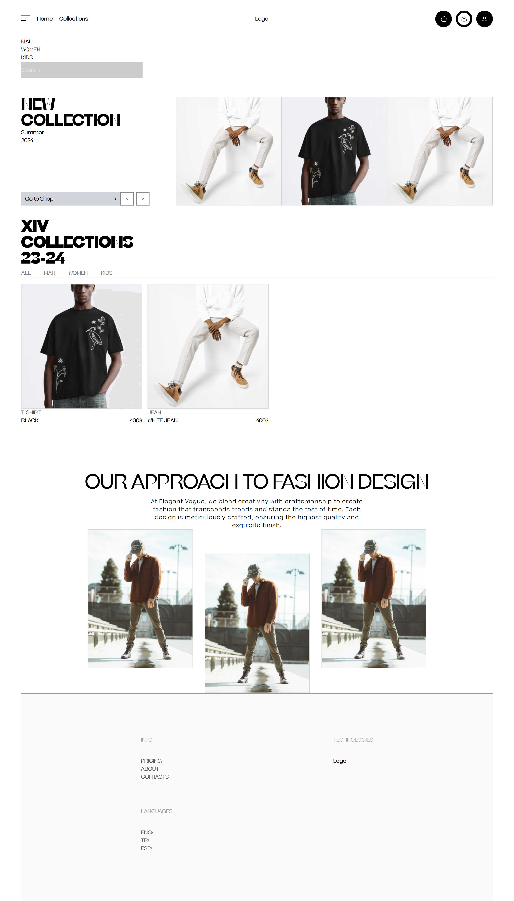
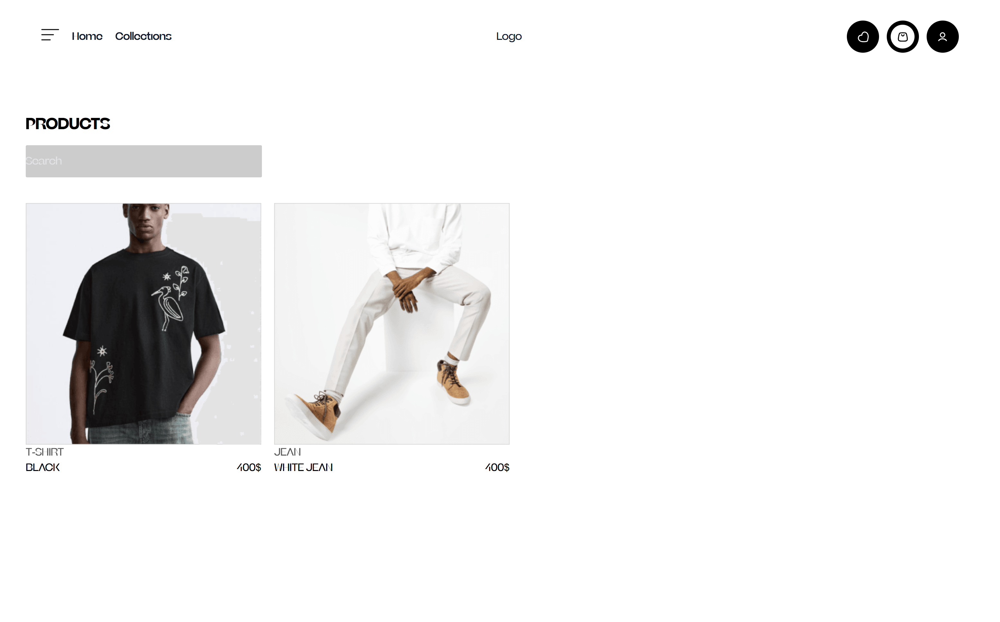
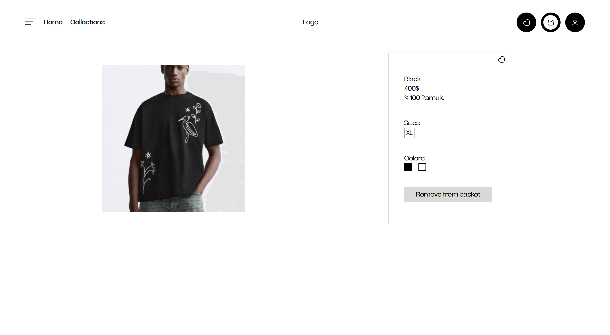
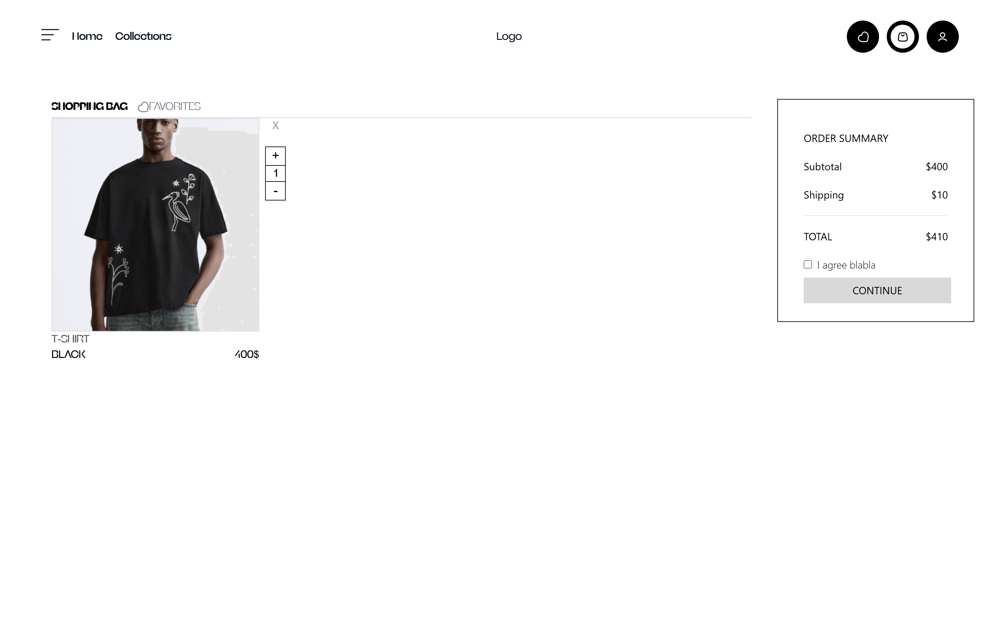
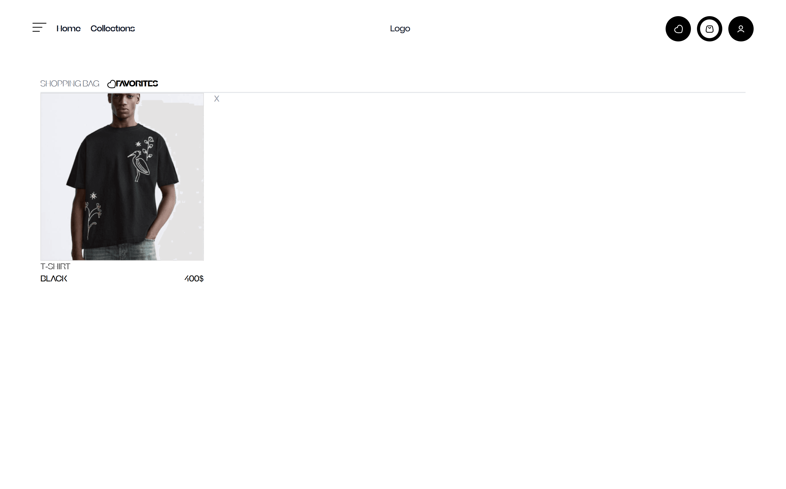
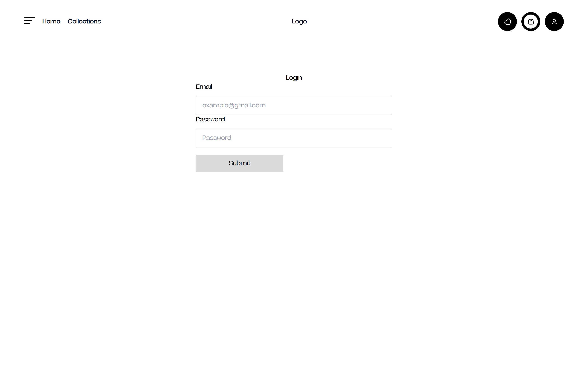
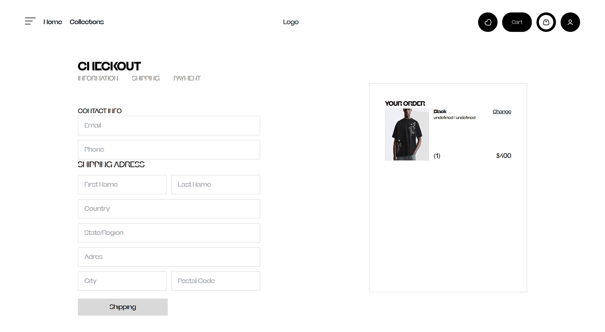
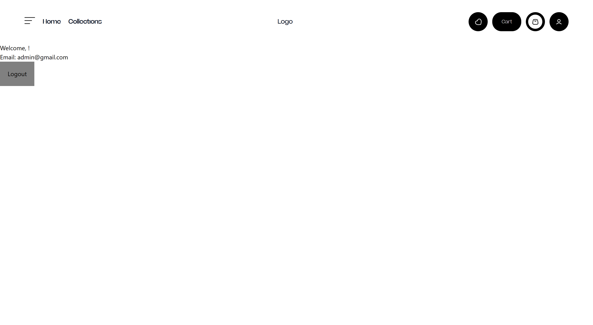

# Ulti-Ecommerce Project

Check out the live demo of the project [here](https://mrtilhan-ecommerce.netlify.app/).

This project uses **Strapi CMS**, which is available on my [Strapi Ecommerce project repository](https://github.com/muratcanilhann/Strapi-Ecommerce), and it has been deployed on **Render**.

The design for this project was inspired by this [Figma UI Kit](https://www.figma.com/design/D3LjmWvmeGI9VjRIrStQ5a/Cloth-Store-%7C-Fashion-Store-%7C-E-commerce-UI-Kit-(Community)?node-id=0-1&node-type=canvas&t=nRFQFyqPI98b0U4H-0).

**Development is ongoing.**

---

### ⚠️ Important Note  
The Strapi CMS backend is hosted on **Render**, which enters a "sleep" mode after a period of inactivity. During this time, data may not load immediately, but the backend will wake up shortly after the first request.

---

### 🖼️ Screenshots  

  
  
  
  
  
  
  
  

---

### 🔑 Login  
- **Email**: `admin@gmail.com`  
- **Password**: `123456`
